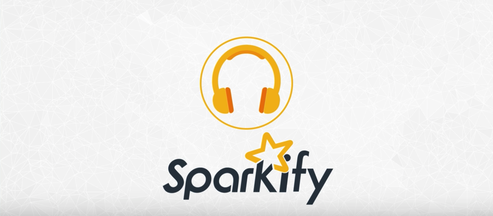

# Udacity Data Engineering Nanodegree
Projects done as part of the [Data Engineering Nanodegree program](https://www.udacity.com/course/data-engineer-nanodegree--nd027) offered by Udacity.

 

## Project 1: [Data Modeling with PostgreSQL](https://github.com/ramapinnimty/Udacity-DataEngineering-Nanodegree/tree/main/01-Data%20Modeling/Project_01-Relational%20Databases-Data%20Modeling%20with%20PostgreSQL)
Developed a SQL database using PostgreSQL to model user activity data for a music streaming app.
* Created a relational database using PostgreSQL locally.
* Developed a Star Schema database using optimized definitions of Fact and Dimension tables and also performed Normalization on tables.
* Built out an ETL pipeline to optimize queries in order to understand what songs users are listening to.

*Tech stack: - Python, PostgreSQL, Star Schema, ETL pipelines, Normalization*

## Project 2: [Data Modeling with Apache Cassandra](https://github.com/ramapinnimty/Udacity-DataEngineering-Nanodegree/tree/main/01-Data%20Modeling/Project_02-Non-Relational%20Databases-Data%20Modeling%20with%20Apache%20Cassandra)
Designed a NoSQL database using Apache Cassandra based on the original schema outlined in `Project 1`.
* Created a NoSQL database using Apache Cassandra locally.
* Developed denormalized tables optimized for a specific set of queries and business needs.

*Tech stack: - Python, Apache Cassandra, Denormalization*

## Project 3: [Data Warehouse using AWS](https://github.com/ramapinnimty/Udacity-DataEngineering-Nanodegree/tree/main/02-Cloud%20Data%20Warehouses/Project_03-Data%20Warehouse%20using%20AWS)
Created a database warehouse utilizing Amazon Redshift.
* Created a Redshift cluster along with the appropriate IAM role and Security group.
* Developed an ETL Pipeline that loads data from S3 buckets into staging tables on Redshift which will be processed using Star schema.
* Optimized queries to enable faster loads as required by the Data Analytics team.

*Tech stack: - Python, AWS CLI, Amazon SDK, PostgreSQL, Amazon S3, Amazon Redshift*
